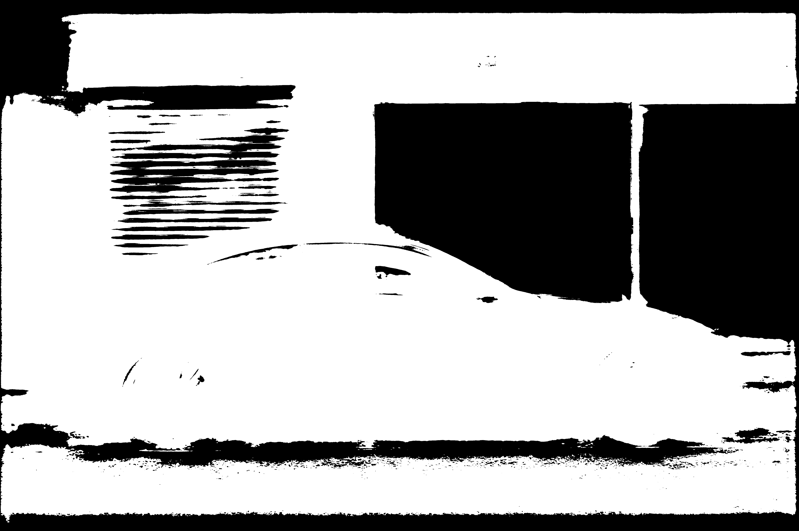
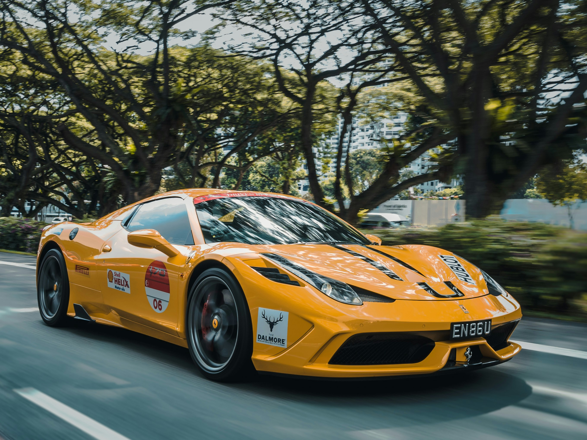
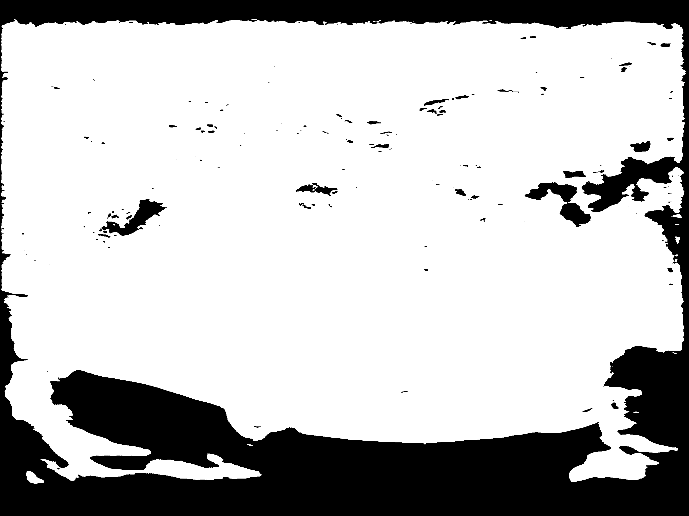
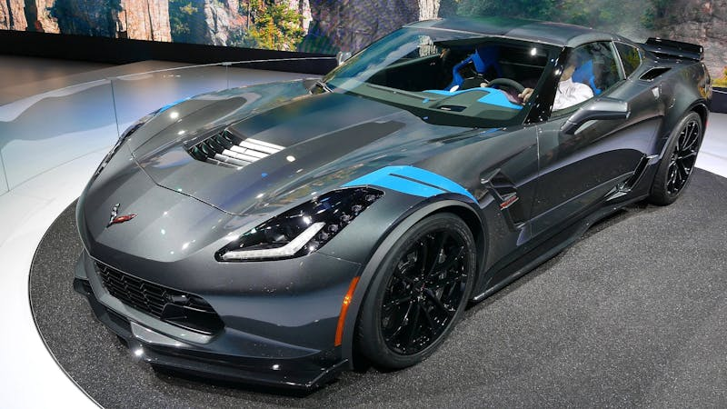
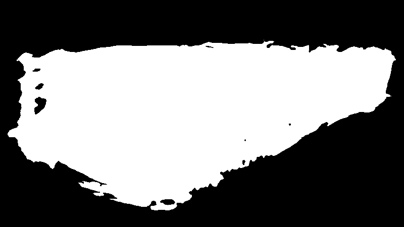
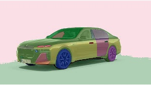
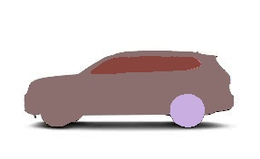

# RECORDS
Only for project1
----
# Basic Task
## U-Net
- install env
```shell
conda activate pdos
cd project1/refs/Pytorch-UNet 
pip install -r requirements.txt
```
- train data
```shell
# unzip your data.zip and copy paste to data folder
# python train.py --amp 建议不要直接开始训练，用下面的命令先跑一遍
python train.py \
    --epochs 5 \
    --batch-size 4 \
    --learning-rate 1e-4 \
    --scale 0.5 \
    --validation 10 \
    #--amp
```

https://github.com/matin-ghorbani/Carvana-Segmentation-UNet

epch=1, test
```shell
(pdos) cxx@cxx-Precision-3660:~/HWs/CS290U/project1/refs/Pytorch-UNet$ python train.py --epochs 1 --batch-size 2 --learning-rate 1e-4 --classes 1
INFO: Using device cuda
INFO: Network:
	3 input channels
	1 output channels (classes)
	Transposed conv upscaling
INFO: Creating dataset with 5088 examples
INFO: Scanning mask files to determine unique values
100%|████████████████████████████████████████████████| 5088/5088 [00:08<00:00, 629.58it/s]
INFO: Unique mask values: [0, 1]
wandb: Currently logged in as: anony-moose-936971435980722001. Use `wandb login --relogin` to force relogin
wandb: wandb version 0.22.2 is available!  To upgrade, please run:
wandb:  $ pip install wandb --upgrade
wandb: Tracking run with wandb version 0.13.5
wandb: Run data is saved locally in /home/cxx/HWs/CS290U/project1/refs/Pytorch-UNet/wandb/run-20251013_210726-4bgqgs0v
wandb: Run `wandb offline` to turn off syncing.
wandb: Syncing run good-water-10
wandb: ⭐️ View project at https://wandb.ai/anony-moose-936971435980722001/U-Net?apiKey=182d6e29a2d95ce26517c966f60310e666db4e27
wandb: 🚀 View run at https://wandb.ai/anony-moose-936971435980722001/U-Net/runs/4bgqgs0v?apiKey=182d6e29a2d95ce26517c966f60310e666db4e27
wandb: WARNING Do NOT share these links with anyone. They can be used to claim your runs.
INFO: Starting training:
        Epochs:          1
        Batch size:      2
        Learning rate:   0.0001
        Training size:   4580
        Validation size: 508
        Checkpoints:     True
        Device:          cuda
        Images scaling:  0.5
        Mixed Precision: False
    
/home/cxx/HWs/CS290U/project1/refs/Pytorch-UNet/train.py:80: FutureWarning: `torch.cuda.amp.GradScaler(args...)` is deprecated. Please use `torch.amp.GradScaler('cuda', args...)` instead.
  grad_scaler = torch.cuda.amp.GradScaler(enabled=amp)
Epoch 1/1:  20%|███▌              | 916/4580 [01:58<07:51,  7.77img/s, loss (batch)=0.424INFO: Validation Dice score: 0.4478                                                        
Epoch 1/1:  40%|██████▊          | 1832/4580 [04:22<05:54,  7.75img/s, loss (batch)=0.121INFO: Validation Dice score: 0.8791                                                        
Epoch 1/1:  60%|██████████▏      | 2748/4580 [06:44<03:57,  7.71img/s, loss (batch)=0.264INFO: Validation Dice score: 0.9278                                                        
Epoch 1/1:  80%|█████████████▌   | 3664/4580 [09:05<01:58,  7.73img/s, loss (batch)=0.116INFO: Validation Dice score: 0.9650                                                        
Epoch 1/1: 100%|████████████████| 4580/4580 [11:27<00:00,  7.74img/s, loss (batch)=0.0633INFO: Validation Dice score: 0.9612                                                        
Epoch 1/1: 100%|████████████████| 4580/4580 [11:50<00:00,  6.45img/s, loss (batch)=0.0633]
INFO: Checkpoint 1 saved!
wandb: Waiting for W&B process to finish... (success).
wandb: 
wandb: Run history:
wandb:           epoch ▁▁▁▁▁▁▁▁▁▁▁▁▁▁▁▁▁▁▁▁▁▁▁▁▁▁▁▁▁▁▁▁▁▁▁▁▁▁▁▁
wandb:   learning rate ▁▁▁▁▁
wandb:            step ▁▁▁▂▂▂▂▂▂▃▃▃▃▃▄▄▄▄▄▄▅▅▅▅▅▅▆▆▆▆▆▇▇▇▇▇▇███
wandb:      train loss █▂▂▃▅▂▂▂▂▂▂▂▃▂▁▁▂▂▂▂▂▁▃▁▂▁▁▂▁▁▁▁▂▁▁▁▁▁▁▁
wandb: validation Dice ▁▇▇██
wandb: 
wandb: Run summary:
wandb:           epoch 1
wandb:   learning rate 0.0001
wandb:            step 2290
wandb:      train loss 0.0633
wandb: validation Dice 0.96119
wandb: 
wandb: Synced good-water-10: https://wandb.ai/anony-moose-936971435980722001/U-Net/runs/4bgqgs0v?apiKey=182d6e29a2d95ce26517c966f60310e666db4e27
wandb: Synced 6 W&B file(s), 15 media file(s), 0 artifact file(s) and 0 other file(s)
wandb: Find logs at: ./wandb/run-20251013_210726-4bgqgs0v/logs
```

----
epch=5, test with amp
```shell
python train.py --epochs 5 --batch-size 4 --learning-rate 5e-5 --classes 1
INFO: Starting training:
        Epochs:          5
        Batch size:      4
        Learning rate:   5e-05
        Training size:   4580
        Validation size: 508
        Checkpoints:     True
        Device:          cuda
        Images scaling:  0.5
        Mixed Precision: False
    
/home/cxx/HWs/CS290U/project1/refs/Pytorch-UNet/train.py:80: FutureWarning: `torch.cuda.amp.GradScaler(args...)` is deprecated. Please use `torch.amp.GradScaler('cuda', args...)` instead.
  grad_scaler = torch.cuda.amp.GradScaler(enabled=amp) # 2.0.1
Epoch 1/5:  20%|███▌              | 916/4580 [01:57<07:43,  7.90img/s, loss (batch)=0.198INFO: Validation Dice score: 0.6432                                                        
Epoch 1/5:  40%|██████▊          | 1832/4580 [04:20<05:48,  7.90img/s, loss (batch)=0.116INFO: Validation Dice score: 0.4389                                                        
Epoch 1/5:  60%|██████████▏      | 2748/4580 [06:39<03:52,  7.88img/s, loss (batch)=0.127INFO: Validation Dice score: 0.6355                                                        
Epoch 1/5:  80%|████████████▊   | 3664/4580 [08:58<01:56,  7.86img/s, loss (batch)=0.0856INFO: Validation Dice score: 0.4913                                                        
Epoch 1/5: 100%|████████████████| 4580/4580 [11:17<00:00,  7.89img/s, loss (batch)=0.0842INFO: Validation Dice score: 0.9761                                                        
Epoch 1/5: 100%|████████████████| 4580/4580 [11:40<00:00,  6.54img/s, loss (batch)=0.0842]
INFO: Checkpoint 1 saved!
Epoch 2/5:  20%|███▍             | 916/4580 [01:57<07:45,  7.87img/s, loss (batch)=0.0441INFO: Validation Dice score: 0.8767                                                        
Epoch 2/5:  40%|██████▍         | 1832/4580 [04:16<05:47,  7.90img/s, loss (batch)=0.0489INFO: Validation Dice score: 0.9645                                                        
Epoch 2/5:  60%|██████████▏      | 2748/4580 [06:36<03:51,  7.90img/s, loss (batch)=0.049INFO: Validation Dice score: 0.9759                                                        
Epoch 2/5:  80%|████████████▊   | 3664/4580 [08:55<01:56,  7.87img/s, loss (batch)=0.0337wandb: Network error (SSLError), entering retry loop. | 111/127 [00:19<00:02,  6.07batch/s]
                                                                                         INFO: Validation Dice score: 0.9784                                                        
Epoch 2/5: 100%|████████████████| 4580/4580 [11:14<00:00,  7.87img/s, loss (batch)=0.0396INFO: Validation Dice score: 0.9752                                                        
Epoch 2/5: 100%|████████████████| 4580/4580 [11:37<00:00,  6.56img/s, loss (batch)=0.0396]
INFO: Checkpoint 2 saved!
Epoch 3/5:  20%|███▍             | 916/4580 [01:57<07:43,  7.91img/s, loss (batch)=0.0408INFO: Validation Dice score: 0.9789                                                        
Epoch 3/5:  40%|██████▍         | 1832/4580 [04:16<05:47,  7.90img/s, loss (batch)=0.0255INFO: Validation Dice score: 0.9756                                                        
Epoch 3/5:  60%|█████████▌      | 2748/4580 [06:35<03:51,  7.91img/s, loss (batch)=0.0421INFO: Validation Dice score: 0.9687                                                        
Epoch 3/5:  63%|██████████▏     | 2908/4580 [07:18<03:33,  7.84img/s, loss (batch)=0.0375]wandb: Network error (SSLError), entering retry loop.
wandb: Network error (SSLError), entering retry loop.
Epoch 3/5:  80%|█████████████▌   | 3664/4580 [08:55<01:56,  7.90img/s, loss (batch)=0.041INFO: Validation Dice score: 0.9843                                                        
Epoch 3/5: 100%|████████████████| 4580/4580 [11:13<00:00,  7.87img/s, loss (batch)=0.0319INFO: Validation Dice score: 0.8559                                                        
Epoch 3/5: 100%|████████████████| 4580/4580 [11:37<00:00,  6.57img/s, loss (batch)=0.0319]
INFO: Checkpoint 3 saved!
Epoch 4/5:  20%|███▍             | 916/4580 [01:57<07:44,  7.89img/s, loss (batch)=0.0321INFO: Validation Dice score: 0.9762                                                        
Epoch 4/5:  40%|██████▍         | 1832/4580 [04:16<05:47,  7.90img/s, loss (batch)=0.0304INFO: Validation Dice score: 0.9853                                                        
Epoch 4/5:  60%|█████████▌      | 2748/4580 [06:35<03:52,  7.88img/s, loss (batch)=0.0622INFO: Validation Dice score: 0.9847                                                        
Epoch 4/5:  80%|████████████▊   | 3664/4580 [08:54<01:56,  7.89img/s, loss (batch)=0.0309INFO: Validation Dice score: 0.9855                                                        
Epoch 4/5: 100%|████████████████| 4580/4580 [11:13<00:00,  7.91img/s, loss (batch)=0.0313INFO: Validation Dice score: 0.9733                                                        
Epoch 4/5: 100%|████████████████| 4580/4580 [11:36<00:00,  6.58img/s, loss (batch)=0.0313]
INFO: Checkpoint 4 saved!
Epoch 5/5:  20%|███▍             | 916/4580 [01:57<07:45,  7.88img/s, loss (batch)=0.0396INFO: Validation Dice score: 0.9827                                                        
Epoch 5/5:  40%|██████▍         | 1832/4580 [04:16<05:48,  7.89img/s, loss (batch)=0.0255INFO: Validation Dice score: 0.9874                                                        
Epoch 5/5:  60%|█████████▌      | 2748/4580 [06:35<03:51,  7.91img/s, loss (batch)=0.0265INFO: Validation Dice score: 0.9830                                                        
Epoch 5/5:  80%|████████████▊   | 3664/4580 [08:54<01:56,  7.90img/s, loss (batch)=0.0309INFO: Validation Dice score: 0.9856                                                        
Epoch 5/5: 100%|████████████████| 4580/4580 [11:13<00:00,  7.90img/s, loss (batch)=0.0266INFO: Validation Dice score: 0.9756                                                        
Epoch 5/5: 100%|████████████████| 4580/4580 [11:36<00:00,  6.57img/s, loss (batch)=0.0266]
INFO: Checkpoint 5 saved!
wandb: Waiting for W&B process to finish... (success).
wandb: - 8.798 MB of 8.798 MB uploaded (0.000 MB deduped)
wandb: Run history:
wandb:           epoch ▁▁▁▁▁▁▁▁▃▃▃▃▃▃▃▃▅▅▅▅▅▅▅▅▆▆▆▆▆▆▆▆████████
wandb:   learning rate ▁▁▁▁▁▁▁▁▁▁▁▁▁▁▁▁▁▁▁▁▁▁▁▁▁
wandb:            step ▁▁▁▁▂▂▂▂▂▃▃▃▃▃▃▄▄▄▄▄▅▅▅▅▅▅▆▆▆▆▆▆▇▇▇▇▇███
wandb:      train loss ███▅▄▇▂▃▂▃▂▃▂▂▂▂▂▂▂▁▂▂▂▄▂▂▂▂▂▂▁▃▂▁▁▁▁▁▁▁
wandb: validation Dice ▄▁▄▂█▇████████▆██████████
wandb: 
wandb: Run summary:
wandb:           epoch 5
wandb:   learning rate 5e-05
wandb:            step 5725
wandb:      train loss 0.02657
wandb: validation Dice 0.97563
wandb: 
wandb: Synced youthful-fog-14: https://wandb.ai/anony-moose-936971435980722001/U-Net/runs/tqf0in2g?apiKey=182d6e29a2d95ce26517c966f60310e666db4e27
wandb: Synced 6 W&B file(s), 75 media file(s), 0 artifact file(s) and 0 other file(s)
wandb: Find logs at: ./wandb/run-20251013_213629-tqf0in2g/logs
```

-----

Predict:

```shell
python predict.py \
  --model ./checkpoints/checkpoint_epoch5.pth \
  --input ./data/custom_data/car{i}.jpg \
  --viz \
  --classes 1 \
  --scale 0.5
```
---
Results:

测试图均来源于网络，仅供参考。

|  No.  |                Original Image                |                Segmented Result                |
| :---: | :------------------------------------------: | :--------------------------------------------: |
|  car1 |    |    |
|  car2 |    |    |
|  car3 |    |    |
|  ... |  ...  |  ...  |
|  car10 |    |    |


小结：
通过结果，可以看出这里的分割效果并不理想，没有识别出车辆的主体，而是把所有的图里的物体都分割出来了，训练集的图只是提供了车主体的单一图，遇到多背景的情况就识别不出来了，并且只是从图片合集里学习到了每张图里像素的相似性，没有学习到车辆的实际含义和图片的关系。

# Advanced Task
## SAM 1
下载三个不同维度的权重：
- https://dl.fbaipublicfiles.com/segment_anything/sam_vit_h_4b8939.pth
- https://dl.fbaipublicfiles.com/segment_anything/sam_vit_l_0b3195.pth
- https://dl.fbaipublicfiles.com/segment_anything/sam_vit_b_01ec64.pth

都放到 models/

单例测试：
这是用最高精度的权重跑mask
```shell
python /home/cxx/HWs/CS290U/project1/refs/segment-anything/scripts/amg.py \
    --checkpoint /home/cxx/HWs/CS290U/project1/refs/segment-anything/models/sam_vit_h_4b8939.pth \
    --model-type vit_h \
    --input /home/cxx/HWs/CS290U/project1/refs/segment-anything/data/car1.jpg \
    --output /home/cxx/HWs/CS290U/project1/refs/segment-anything/outputs/cars \
    --convert-to-rle
```

用脚本叠加mask到原图并copy成新图：(project1/refs/segment-anything/scripts/mask_add.py)
```shell
python scripts/mask_add.py \
  --image /home/cxx/HWs/CS290U/project1/refs/segment-anything/data/car1.jpg \
  --json /home/cxx/HWs/CS290U/project1/refs/segment-anything/outputs/cars/car1.json \
  --output /home/cxx/HWs/CS290U/project1/refs/segment-anything/outputs/cars/car1_overlay.jpg
```

批量脚本：(project1/refs/segment-anything/test.sh)
```shell
chmod +x /home/cxx/HWs/CS290U/project1/refs/segment-anything/test.sh
bash /home/cxx/HWs/CS290U/project1/refs/segment-anything/test.sh
```

判断结果是否符合SAM定义的标准：(project1/refs/segment-anything/scripts/summarize.py)
```shell
python scripts/summarize.py \
  --input-dir /home/cxx/HWs/CS290U/project1/refs/segment-anything/outputs/cars \
  --output-csv /home/cxx/HWs/CS290U/project1/refs/segment-anything/outputs/summary.csv
```
SAM 1 (Segment Anything Model) 的目标是实现 通用几何分割（generic instance segmentation），
而非语义特定分割（semantic segmentation）。
它追求的是「把所有可能有边界的区域都找出来」，而不是「找到特定语义的掩膜」。
所以这里的评分是很高的，但是针对的是多目标分割；
针对车的语义分割并不是很好。

----
Results:

测试图均来源于网络，仅供参考。

|  No.  |                Original Image                |                Segmented Result                |
| :---: | :------------------------------------------: | :--------------------------------------------: |
|  car1 |    |    |
|  car2 |    |    |
|  car3 |    |    |
|  ... |  ...  |  ...  |
|  car25 |    |    |

小结：
SAM1 实现了通用几何分割，但针对车的语义分割并不是很好。multi-mask能划分出更多的区域，但也会导致主体过多。


## GroundingDINO + SAM

下载DINO的权重：
https://github.com/IDEA-Research/GroundingDINO/releases/download/v0.1.0-alpha/groundingdino_swint_ogc.pth

降级`numpy` < 2.0: 
```shell
pip install "numpy<2.0" --force-reinstall
python3 test.py
```

### Trouble Shooting
Bugs:
```shell
NameError: name '_C' is not defined
```

Solution: check nvcc and home path.
```shell
echo $CUDA_HOME
# possible FIXED method
pip install torch==2.2.2 torchvision==0.17.2 torchaudio==2.2.2

cd /home/cxx/HWs/CS290U/project1/refs/GroundingDINO
pip install -e .
```

combine.py: 先用DINO来预测和语义有关的框，再用SAM来进行分割区域

单例测试：(project1/refs/GroundingDINO/combine.py)
```shell
python combine.py \
   --dino-config groundingdino/config/GroundingDINO_SwinT_OGC.py \
   --dino-weights models/groundingdino_swint_ogc.pth \
   --sam-weights ../segment-anything/models/sam_vit_h_4b8939.pth \
   --image ../segment-anything/data/car1.jpg \
   --text "car, vehicle, automobile, wheel, window" \
   --output outputs/cars \
   --box-thresh 0.2 \
   --text-thresh 0.2 \
   --multimask 1
```

多样例测试：（project1/refs/GroundingDINO/test.sh）
```shell
cd /home/cxx/HWs/CS290U/project1/refs/GroundingDINO
chmod +x test.sh
./test.sh
```
---
Results:

测试图均来源于网络，仅供参考。

|  No.  |                Original Image                |                Segmented Result                |
| :---: | :------------------------------------------: | :----------: |
|  car1 |    |    |
|  car2 |    |    |
|  car3 |    |    |
|  ... |  ...  |  ...  |
|  car25 |    |    |
----
小结：
通过先在图片中使用提示词来用DINO预测框，定位目标物体，之后再用SAM进行区域分割，可以实现用语义信息来分割目标物体。
可以从图片结果看出，之前多目标区域分割的结果已经被集中到车有关的区域上了。这里使用的提示词是：car, vehicle, automobile, wheel, window，可以尝试其他的提示词来测试更多的效果。


> Basic Task的部分只用了10张图，是用于简单测试；Advanced Task为主，所以不作为前后对比，而是把组合方式和单一SAM1作为对比。