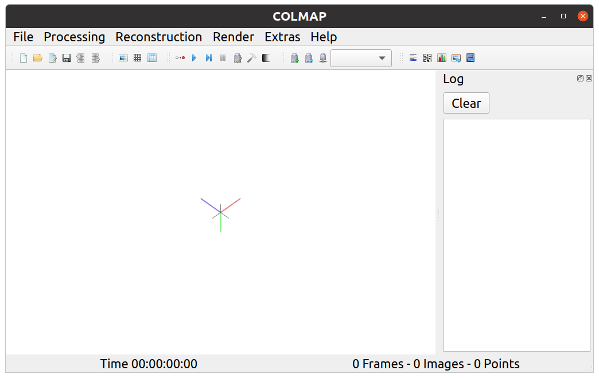
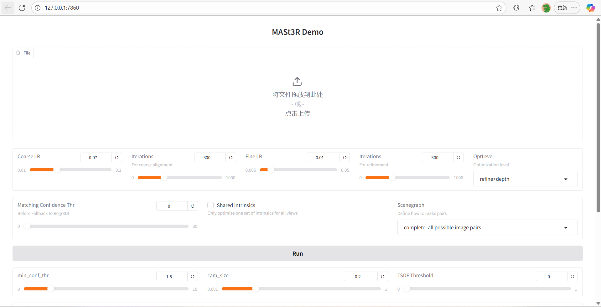

# RECORDS
Only for project 2
----
# Basic Task
## Env Setup
> Install [colmap 3.12.6](https://colmap.github.io/install.html#debian-ubuntu) in Ubuntu 20.04.

- Possible Error 1:
```shell
-- Found CUDA version 12.2 installed in /usr/local/cuda-12.2 via legacy CMake (<3.17) module. Using the legacy CMake module means that any installation of COLMAP will require that the CUDA libraries are available under LD_LIBRARY_PATH.
-- Found CUDA 
--   Includes : /usr/local/cuda-12.2/include
--   Libraries : /usr/local/cuda-12.2/lib64/libcudart_static.a;-lpthread;dl;/usr/lib/x86_64-linux-gnu/librt.so
-- The CUDA compiler identification is NVIDIA 12.2.91
-- Check for working CUDA compiler: /usr/local/cuda-12.2/bin/nvcc
CMake Error in /home/cxx/HWs/CS290U/project2/refs/colmap/build/CMakeFiles/CMakeTmp/CMakeLists.txt:
  Target "cmTC_ac3f1" requires the language dialect "CUDA17" (with compiler
  extensions), but CMake does not know the compile flags to use to enable it.


CMake Error at /usr/share/cmake-3.16/Modules/CMakeTestCUDACompiler.cmake:30 (try_compile):
  Failed to generate test project build system.
Call Stack (most recent call first):
  cmake/FindDependencies.cmake:147 (enable_language)
  CMakeLists.txt:112 (include)
```
CMake需要更新到3.17以上版本，自带的是3.16, 现在我用的是4.1.2
```shell
# 1. 移除旧 CMake
sudo apt remove --purge cmake -y

# 2. 添加新版仓库
sudo apt install -y software-properties-common lsb-release wget gnupg
wget -O - https://apt.kitware.com/keys/kitware-archive-latest.asc 2>/dev/null | \
  gpg --dearmor - | sudo tee /usr/share/keyrings/kitware-archive-keyring.gpg >/dev/null
echo "deb [signed-by=/usr/share/keyrings/kitware-archive-keyring.gpg] https://apt.kitware.com/ubuntu/ focal main" | \
  sudo tee /etc/apt/sources.list.d/kitware.list > /dev/null


# 3. 安装新版 CMake
sudo apt update
sudo apt install -y cmake

# 4. 设置 CUDA 环境变量
echo 'export LD_LIBRARY_PATH=/usr/local/cuda-12.2/lib64:$LD_LIBRARY_PATH' >> ~/.bashrc
source ~/.bashrc

# 5. 重新编译 COLMAP
cd ~/HWs/CS290U/project2/refs/colmap
rm -rf build
mkdir build && cd build
cmake ..
make -j$(nproc)
sudo make install
```
- Possible Error 2:
```shell
error: invalid conversion from ‘const double*’ to ‘double*’ [-fpermissive]
  problem.IsParameterBlockConstant(point3D.xyz.data())
```
新版代码不支持的写法，需要修改：
```shell
gedit ~/HWs/CS290U/project2/refs/colmap/src/colmap/estimators/bundle_adjustment.cc
# 跳到 第 453 行 ctrl+F: if (problem.IsParameterBlockConstant(point3D.xyz.data()) &&
# 改成： if (problem.IsParameterBlockConstant(const_cast<double*>(point3D.xyz.data())) &&
# 重新编译
make -j$(nproc)
sudo make install
```
----
验证版本：
```shell
colmap -h
COLMAP 3.12.6 -- Structure-from-Motion and Multi-View Stereo
(Commit Unknown on Unknown with CUDA)
...
# GUI 界面
colmap gui
```


----
## Dataset Preparation

Get data from [here](https://cvg.cit.tum.de/data/datasets/rgbd-dataset/download).
My item is Sequence `freiburg1_desk2_validation` (without GT).
Select 36 images from the sequence.

```shell
mkdir colmap_workspace
colmap database_creator --database_path colmap_workspace/database.db

colmap database_creator --database_path colmap_workspace/database2.db
```
### Feature Extraction
```shell
# customized folder
cd ~/HWs/CS290U/project2/
colmap feature_extractor \
    --database_path colmap_workspace/database.db \
    --image_path data/test_data \
    --ImageReader.single_camera 1

colmap feature_extractor \
    --database_path colmap_workspace/database2.db \
    --image_path data/mobile_data/front_frames \
    --ImageReader.single_camera 1
```
### Feature Matching
这里经过测试使用连续匹配会得到准确的局部位姿，但是对于全局坐标系来说测定的坐标并不准确，所以放进superglue之后AUC会为0，而且点的匹配程度会很高。

Sequential Match Mode:
```shell
colmap sequential_matcher --database_path colmap_workspace/database.db
```
Exhaustive Match Mode:
```shell
colmap exhaustive_matcher --database_path colmap_workspace/database2.db
```

### Incremental Reconstruction
```shell
mkdir colmap_workspace/sparse
colmap mapper \
    --database_path colmap_workspace/database.db \
    --image_path data/test_data \
    --output_path colmap_workspace/sparse

mkdir colmap_workspace/sparse2
colmap mapper \
    --database_path colmap_workspace/database2.db \
    --image_path data/mobile_data/front_frames \
    --output_path colmap_workspace/sparse2
```
这里会生成二进制文件，要转成txt:
```shell
colmap model_converter \
    --input_path colmap_workspace/sparse/0 \
    --output_path colmap_workspace/results/0 \
    --output_type TXT

colmap model_converter \
    --input_path colmap_workspace/sparse2/0 \
    --output_path colmap_workspace/results2/0 \
    --output_type TXT
```
| 文件名            | 含义   | 内容                                     |
| -------------- | ---- | -------------------------------------- |
| `cameras.txt`  | 相机内参 | fx, fy, cx, cy, 图像宽高等                  |
| `images.txt`   | 相机外参 | 四元数 (qw,qx,qy,qz), 平移向量 (tx,ty,tz)，图像名 |
| `points3D.txt` | 稀疏点云 | 每个点的坐标、颜色、被哪些图像观测到                     |

### Convert to Specific Format
`SuperGluePretrainedNetwork/demo_superglue.py`:
示例片段（大约在第 90 行附近）：
```python
pair = {
    'image0': image0_path,
    'image1': image1_path,
    'keypoints0': keypoints0,  # shape [N0, 2]
    'keypoints1': keypoints1,  # shape [N1, 2]
    'matches': matches,        # shape [N0], index of matching keypoint in image1 or -1
    'match_confidence': conf   # shape [N0], confidence scores
}
```
写一个脚本文件用于转化现有数据为输入这个项目的格式：
`~/HWs/CS290U/project2/colmap_workspace/convert2superglue.py`:
```shell
cd ~/HWs/CS290U/project2

python colmap_workspace/convert2superglue.py \
  --input_path colmap_workspace/results/0 \
  --image_dir data/test_data \
  --output colmap_workspace/results/0

python colmap_workspace/convert2superglue.py \
  --input_path colmap_workspace/results2/0 \
  --image_dir data/mobile_data/front_frames \
  --output colmap_workspace/results2/0
```

----
### Use Sequential mode
```shell
AUC@5	 AUC@10	 AUC@20	 Prec	 MScore	
0.00	 0.00	 0.72	 42.61	 33.95	
```
### Use Exhaustive mode
```shell

```
# Advanced Task
## Datasets
- https://huggingface.co/datasets/BoDai/MatrixCity/tree/main
- https://huggingface.co/datasets/BoDai/HorizonGS/tree/main/real

划分数据：
- 场景1：
> MatrixCity: small_city/street/test/small_city_road_outside_test.tar (765MB)

- 场景2：
> HorizonGS: real/park.zip (3.37GB), real/road.zip (1.73GB)

- 场景3: 
> MatrixCity: aerial_street_fusion/aerial.tar (1.72GB)

----

## Match Evaluation Task
先来最简单的SuperGlue, 因为它自己带了一个eval模式，直接对gt做处理转换之后跑匹配代码。
具体见 [notes](./data/mobile_data/notes.md)

### superglue


## mast3r
Prepare: 注意要一起下载dust3r否则用不了
```shell
git clone --recursive https://github.com/naver/mast3r.git
cd mast3r
ls dust3r
pip install -r requirements.txt
```
Run demo:
```shell
python3 demo.py   --model_name MASt3R_ViTLarge_BaseDecoder_512_catmlpdpt_metric
```
看到下载预训练模型，说明正确。
```shell
(pdos) cxx@cxx-Precision-3660:~/HWs/CS290U/project2/refs/mast3r$ python3 demo.py   --model_name MASt3R_ViTLarge_BaseDecoder_512_catmlpdpt_metric --tmp_dir /home/cxx/HWs/CS290U/project2/refs/mast3r/outputs/1_small_city_20p
Warning, cannot find cuda-compiled version of RoPE2D, using a slow pytorch version instead
config.json: 546B [00:00, 1.51MB/s]
model.safetensors: 100%|█████████████████| 2.75G/2.75G [01:17<00:00, 35.7MB/s]
[2025-10-26 16:58:32] Outputing stuff in /tmp/tmpudadlp2w_mast3r_gradio_demo/a80583ad5217858177c4ebdcac94a5fd
[2025-10-26 16:58:32] * Running on local URL:  http://127.0.0.1:7860
[2025-10-26 16:58:32] * To create a public link, set `share=True` in `launch()`.
```
访问： http://127.0.0.1:7860 测试

- 分别选10-20张图片进来测试，这里选择场景1-3的数据集图片：
  - small_city: 
  - road:
  - aerial_street: 
```shell
pip install pygltflib
```
python refs/mast3r/demo.py --model_name MASt3R_ViTLarge_BaseDecoder_512_catmlpdpt_metric
python refs/mast3r/demo_dust3r_ga.py --model_name MASt3R_ViTLarge_BaseDecoder_512_catmlpdpt_metric


| **Dataset**              | **Model** | **AUC@5** | **AUC@10** | **AUC@20** | **Prec** | **MScore / MError** |
| ------------------------ | --------- | --------: | ---------: | ---------: | -------: | ------------------: |
| **Aerial_h (nadir)**     | SuperGlue |     17.99 |      26.35 |      32.59 |    25.58 |                8.44 |
|                          | MASt3R    |     98.37 |      99.59 |          – |    98.37 |             3.14 px |
|                          | VGGT      |     99.81 |      99.92 |      99.96 |    99.64 |             0.92 px |
| **Aerial_q (oblique)**   | SuperGlue |     18.02 |      27.95 |      34.62 |    22.98 |                7.99 |
|                          | MASt3R    |     97.19 |      99.36 |          – |    97.19 |             3.41 px |
|                          | VGGT      |     99.58 |      99.77 |      99.92 |    99.30 |             1.07 px |
| **Street_cam1 (ground)** | SuperGlue |     15.29 |      40.60 |      65.43 |    31.77 |               13.02 |
|                          | MASt3R    |     97.45 |      98.60 |          – |    97.45 |             3.04 px |
|                          | VGGT      |     97.57 |      98.78 |      99.40 |    95.85 |             2.69 px |


| **Aspect**          | **MASt3R**                                                                | **VGGT**                                                             |
| ------------------- | ------------------------------------------------------------------------- | -------------------------------------------------------------------- |
| **Model Type**      | Dual-view feature matching (asymmetric 3D regression)                     | Transformer-based multi-view geometric modeling                      |
| **Input**           | Two images with known camera poses                                        | Two images with known camera poses (with adaptive resizing)          |
| **Output**          | Per-pixel 3D coordinates projected to the other view                      | Dense per-pixel 3D point cloud                                       |
| **Evaluation Core** | Cross-view reprojection error (geometric consistency)                     | End-to-end point cloud reprojection error (structural consistency)   |
| **Main Metrics**    | AUC@5/10/20, Prec@3px, MeanErr                                            | Same metrics (+ enhanced visualization)                              |
| **Strengths**       | Accurately reflects matching quality and geometric constraint reliability | Directly measures reconstruction capability and structural coherence |
| **Limitations**     | Depends on pretrained feature matching; sensitive to image scale          | Requires fixed-resolution inputs; computationally expensive          |
